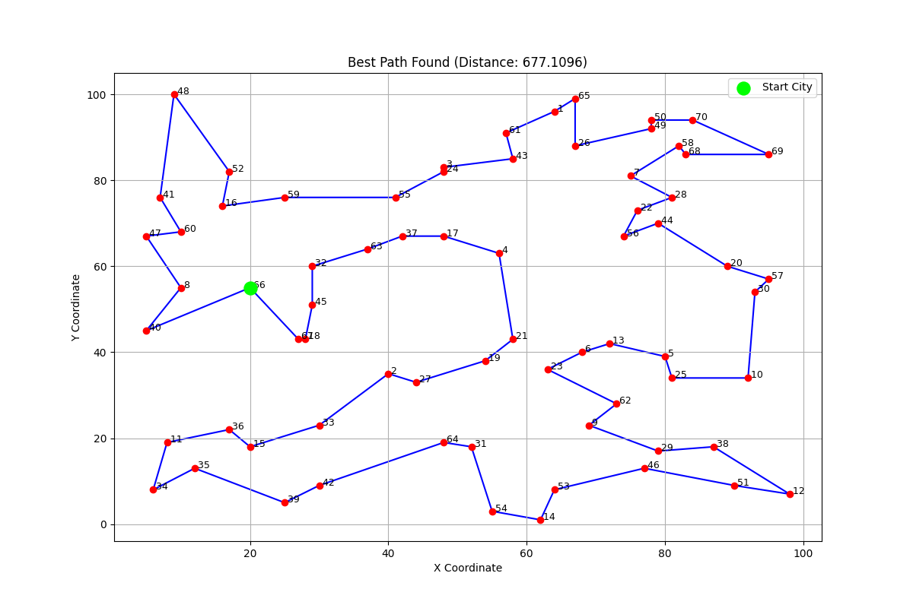
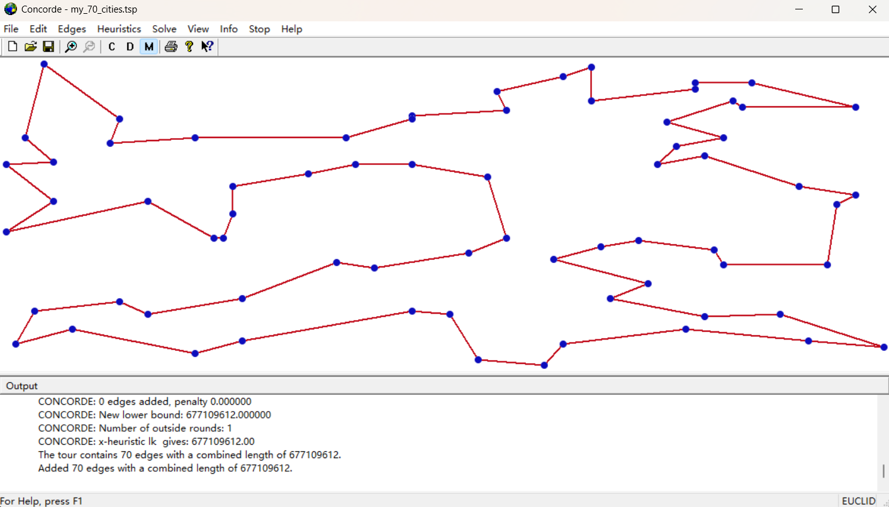

# Solving the Travelling Salesman Problem with Genetic Algorithms

This repository contains the source code and experimental results for the "Travelling Salesman Problem by GA" project for the Computational Intelligence course. The project involves designing, implementing, and progressively optimizing a Genetic Algorithm (GA) to solve the Travelling Salesman Problem (TSP) for both an 8-city demo and a more complex 70-city challenge.

## Project Structure

The repository is organized as follows:

-   `70_Cities_TSP.py`: The main Python script containing the implementation of our most advanced algorithm (a Memetic Algorithm) and the framework for running multiple experiments.
-   `Locations_70_Citys.xlsx`: The input Excel file containing the coordinates for the 70-city problem.
-   `figures/`: A directory containing the output graphs, GIFs, and text files from our various experiments.
-   `concorde_path.png`: A visualization of the certified global optimal path found by the Concorde TSP Solver.
-   `my_70_cities.tsp`: The TSPLIB-formatted file generated from the Excel data, used as input for Concorde.
-   `xlsx2tsp.py`: A utility script to convert the `.xlsx` coordinate file into the `.tsp` format.
-   `README.md`: This file.

---

## Algorithms Implemented

We designed and compared four different strategies to evaluate the impact of different components on the algorithm's performance:

1.  **Standard GA (GA-Swap)**: A baseline Genetic Algorithm using simple Swap Mutation.
2.  **Improved GA (GA-Inverse)**: An improved GA that uses the more effective Inversion Mutation operator.
3.  **Memetic Algorithm (MA-Swap)**: A hybrid algorithm combining the baseline GA with a powerful **2-opt local search** heuristic.
4.  **Advanced Memetic Algorithm (MA-Inverse)**: Our top-performing strategy, which combines the improved GA (with Inversion Mutation) and the 2-opt local search.

## How to Run the Experiments

### Prerequisites
You will need Python 3 installed, along with the following libraries:
-   `numpy`
-   `pandas`
-   `matplotlib`
-   `openpyxl`

You can install them via pip:
```bash
pip install numpy pandas matplotlib openpyxl
```

### Running the Main Script
The `70_Cities_TSP.py` script is configured to run a full experimental evaluation.

1.  Ensure `Locations_70_Citys.xlsx` is in the same directory as the script.
2.  Run the script from your terminal:
    ```bash
    python 70_Cities_TSP.py
    ```
3.  The script will execute **30 independent runs** of the configured algorithm. This process is computationally intensive and may take a significant amount of time (approx. 50-60 minutes).
4.  Upon completion, it will print a statistical summary report to the console and display visualizations (convergence curve, best path map) of the best run found across all trials.
5.  It will also save an animation of the best run's evolution as `best_run_evolution.gif`.

**Note:** You can easily switch between the four tested algorithms by modifying the `run` method in the script (e.g., changing the mutation operator or commenting out the 2-opt call).

---

## Key Findings & Results

Our experiments, conducted under a comparable time budget for each strategy, led to clear conclusions. The performance was benchmarked against the **global optimum of 677.1096**, which we certified using the [Concorde TSP Solver]([Concorde Home](https://www.math.uwaterloo.ca/tsp/concorde.html)).

### Performance Summary (30 Runs)

| Algorithm             | Best         | Mean         | Std Dev    | Success Rate |
| :-------------------- | :----------- | :----------- | :--------- | :----------- |
| Standard GA (GA-Swap) | 684.9534     | 710.9578     | 14.0756    | 0%           |
| GA (Inversion)        | **677.1096** | 698.5092     | 13.0267    | 3.3%         |
| MA (Swap)             | **677.1096** | 684.7963     | 4.4679     | 13.3%        |
| **MA (Inversion)**    | **677.1096** | **684.3857** | **4.2406** | **16.7%**    |

### Conclusions

1.  **Inversion Mutation is Superior:** It consistently outperforms Swap Mutation, enabling the pure GA to find the global optimum.
2.  **Memetic Algorithms are Transformative:** Hybridizing the GA with a 2-opt local search provides a massive boost in solution quality, stability, and convergence speed.
3.  **The Combination is Key:** The **MA-Inverse** strategy, combining the best mutation operator with local search, is the undisputed winner, demonstrating the highest average performance and the best success rate in finding the global optimum.

### Visualization of the Best Result
This is the optimal path found by our best algorithm (MA-Inverse), which is identical to the path found by Concorde.





**Note on Precision:** To achieve the highest possible accuracy, the result from Concorde was obtained by scaling the original coordinates by a factor of 1,000,000 before solving. This yielded an integer optimal length of `677,109,612`, which, when scaled back, gives a high-precision global optimum of **677.109612**. Our algorithm's ability to match this tour structure demonstrates its high effectiveness.